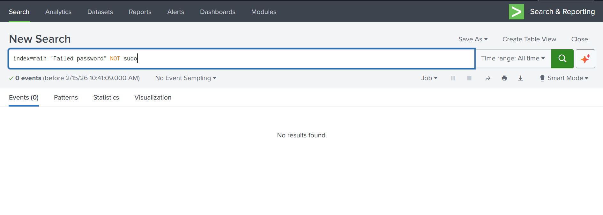
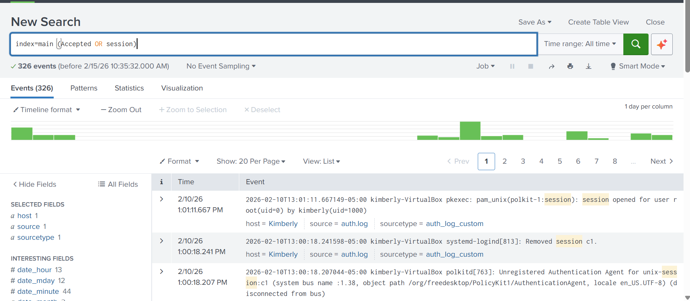

# Splunk Investigation 01 – Authentication Analysis

## Objective
Identify failed logins, successful logins, and unusual authentication patterns using Splunk searches.

## Environment
- Splunk (Free / Training Environment)

## Data Source
- Sample authentication and security events

## SPL Queries Used
```spl
index=* authentication
index=* (failed OR failure)
index=* (success OR accepted)
| stats count by user, src_ip
| sort - count
```
## Findings
- Linux authentication logs were successfully ingested into Splunk and confirmed searchable.
- A small number of failed password attempts were identified during the selected time range.
- Multiple successful login and session events were observed and appeared consistent with normal user behavior.
- No patterns indicating brute-force attacks or suspicious authentication activity were detected.


## Evidence

### Failed Password Activity


### Successful / Session Activity



## Conclusion
This investigation focused on reviewing authentication activity using Linux auth logs in Splunk.  
Based on the searches performed, the observed login behavior appears normal with no clear indicators of malicious activity at this time.

This investigation demonstrates my ability to ingest log data, run SPL searches, analyze authentication events, and document findings in a clear and structured way.


## Evidence
- Screenshots will be added after running the SPL searches.
