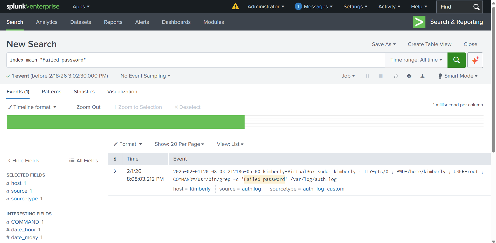
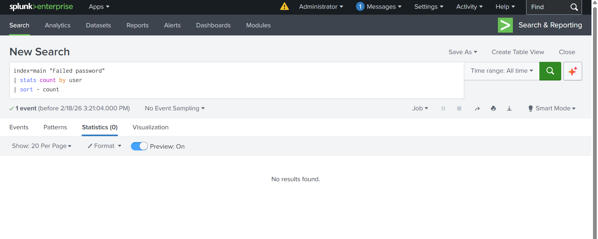
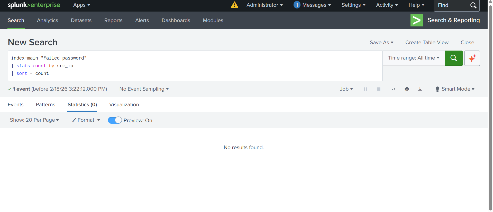

# Splunk Investigation 02 – Failed Login Pattern Analysis

## Objective
Analyze failed authentication events to identify repeated login failures, user patterns, or potential indicators of brute-force activity.

## Environment
- Splunk (Free / Training Environment)

## Data Source
- Linux authentication logs (auth.log)

## SPL Queries Used

## Failed password events
```spl

index=main "Failed password"
| stats count by user
| sort - count
```
## Failed logins by source IP
```spl
index=main "Failed password"
| stats count by src_ip
| sort - count
```
## Findings
- A limited number of failed password events were identified in the authentication logs.
- No repeated failed login attempts were observed for any individual user.
- No source IP addresses showed multiple failed login attempts.
- The absence of repeated failures suggests no evidence of brute-force or password-spraying activity in the dataset.

## Evidence

### Failed Password Events
The screenshot below shows failed password activity identified in Splunk.



### Failed Logins by User
This search returned no results, indicating no users experienced repeated failed login attempts.



### Failed Logins by Source IP
This search returned no results, indicating no source IP addresses generated repeated failed login attempts.



## Conclusion
This investigation focused on analyzing failed authentication activity within Linux authentication logs using Splunk.  
Based on the searches performed, only a minimal number of failed login events were observed, with no patterns indicating repeated failures by user or source IP.

At this time, there is no evidence of brute-force or other suspicious authentication activity.
This investigation demonstrates my ability to analyze authentication logs, identify potential security indicators, and document findings clearly even when activity levels are low.
