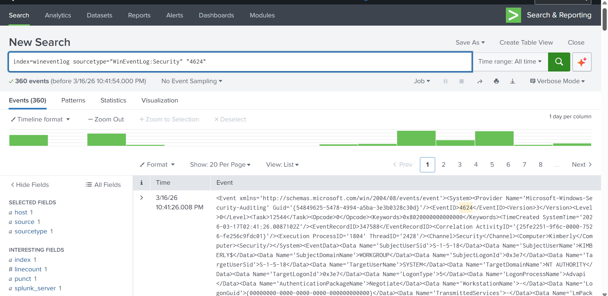
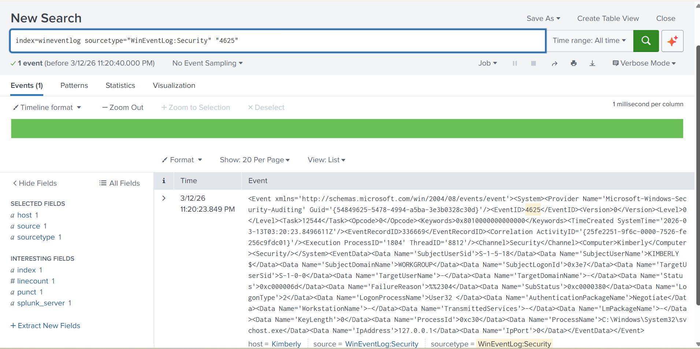
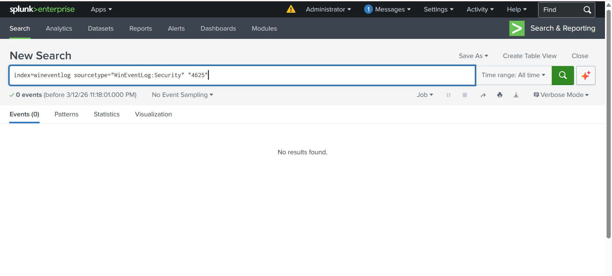
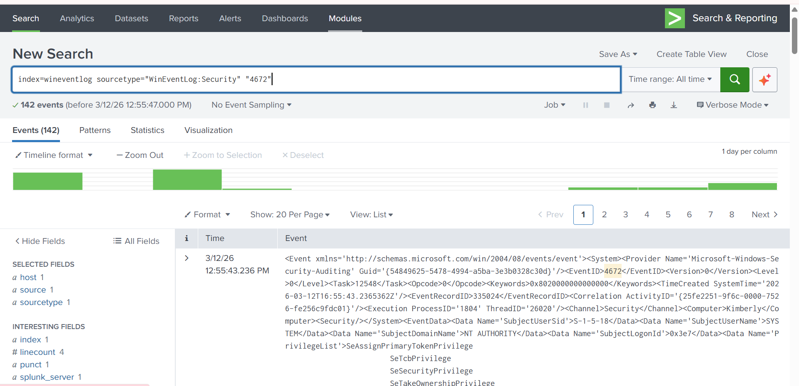

# Splunk Investigation 04 – Windows Authentication & Privilege Review

## Objective
Analyze Windows authentication and privilege-related events to identify successful logins, failed login attempts, and potential privileged activity.

## Environment
- Windows OS
- Splunk (Free / Training Environment)

## Data Source
- Windows Security Event Logs

## SPL Queries Used

### Successful logons
```spl
EventCode=4624
```
**Example Event Evidence**


### Failed logons
```spl
EventCode=4625
```
**Failed Login Attempt Evidence**


**Initial Query With No Results**


### Privileged logons
```spl
EventCode=4672
```
**Privileged Logon Event Evidence**


## Findings
- Event ID **4624** confirms successful authentication events in the system.
- Event ID **4625** identifies failed login attempts and can be used to detect brute-force activity.
- Event ID **4672** shows when privileged accounts receive elevated permissions during logon.

These events are important indicators when monitoring authentication activity during security investigations.

## Conclusion
This investigation demonstrates how Splunk can be used to analyze Windows authentication activity and detect important login-related events.

By monitoring Event IDs 4624, 4625, and 4672, security analysts can identify successful logins, failed authentication attempts, and privileged access activity. These events are commonly used in security monitoring and incident investigations to detect suspicious login behavior.
